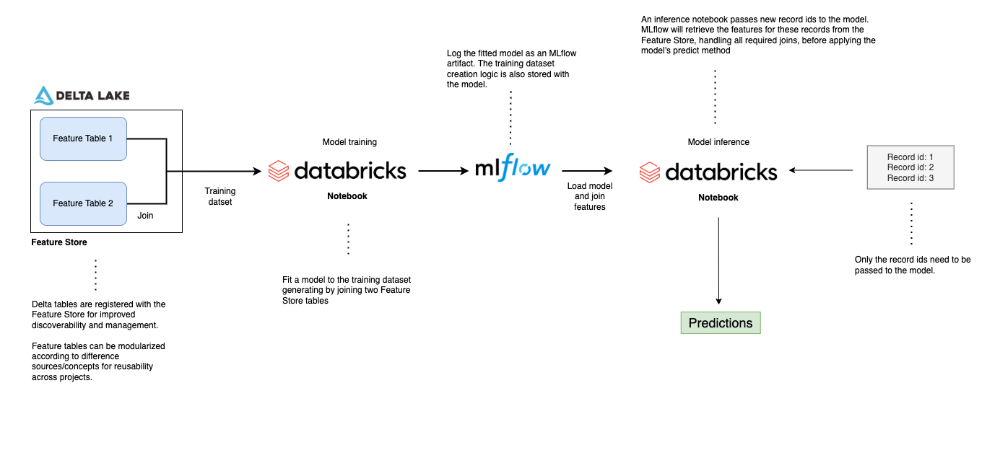

# Databricks Feature Store example project

This Databricks [Repo](https://docs.databricks.com/repos.html) provides an example [Feature Store](https://docs.databricks.com/applications/machine-learning/feature-store/index.html) workflow based on the titanic dataset. The dataset is split into two domain specific tables: features based on purchases and demographic information. Machine learning features are typically sourced from many underlying tables/sources, and this simple workflow is designed to mimic this characteristic.

Also, by creating domain-specific feature sets, tables become more modular and can be leveraged across multiple projects and across teams. 

**Note**: If you require model deployment via Rest API, see the **online_store** directory for a demo deployment.

## Getting started

Note: Step 3 below differs slightly for AWS Single Tenant customers.

1. Clone this repository into a Databricks Repo

2. Provision a Databricks Cluster with an [ML Runtime](https://docs.databricks.com/runtime/mlruntime.html). This project was developed using runtime 10.3 ML.

3. Run the **delta_table_setup** notebook to create the source tables used for feature generation.
    - This notebook uses [arbitrary file support](https://docs.databricks.com/repos.html#work-with-non-notebook-files-in-a-databricks-repo) by referencing a function stored in a .py file. Also, note the use of [ipython autoloading](https://ipython.org/ipython-doc/3/config/extensions/autoreload.html) for rapid development of functions and classes.  
    - Arbitrary files are not support for AWS Single Tenant customers, though this project will still run with minor alterations.
      - Clone the repository to your local machine. Then, select the Data tab on the left hand pane of the Databricks UI. Choose DBFS and upload the three .csv files to a directory of your choosing.

      - Instead of running the delta_table_setup notebook, which relies on a .py file, run the **st_create_tables** Notebook in the data folder of the Databricks Repo. Be sure to alter the 'dbfs_file_locations' variable to match the directories you chose during file upload to DBFS.

  
4. Run the **passenger_demographic_features** and **passenter_ticket_features** notebooks to create and populate the two feature store tables. 
    - Navitate to the Feature Store icon on the left pane of the Databricks UI. There will be two entries, one for each feature table.

5. Run the **fit_model** notebook, which will perform the following tasks.
    -  Create an MLflow experiment
    - Create a training dataset by joining the two Feature Store tables
    - Fit a model to the training dataset
     - Log the model and the training dataset creation logic to the MLflow experiment
     - Create an entry for the model in the Model Registry
    - Promote the model to the 'Production' stage  

6. Run the  **model_inference** notebook, which will perform the following tasks. 
    - Create a sample DataFrame of new record ids to score 
    - Create a helper function that given a model name and stage, will load the model's unique id
    - Apply the model to the record ids. MLflow joins the relevent features to the record ids before applying the model and generating a prediction.
