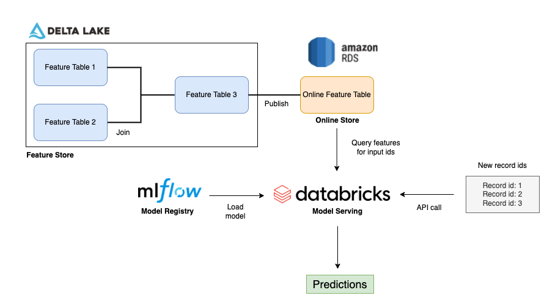
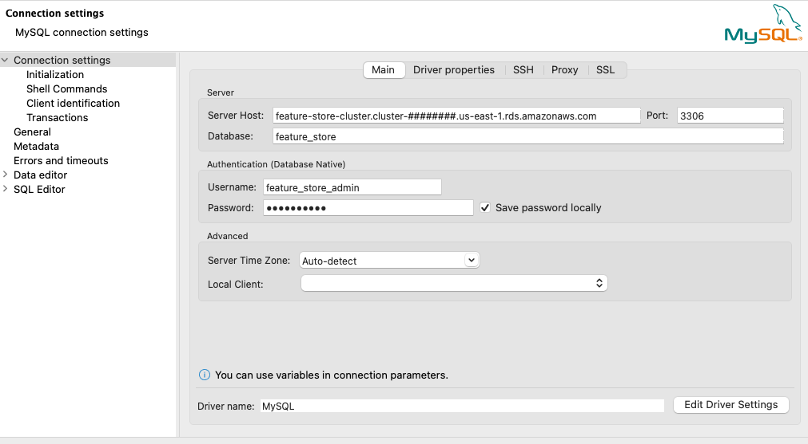
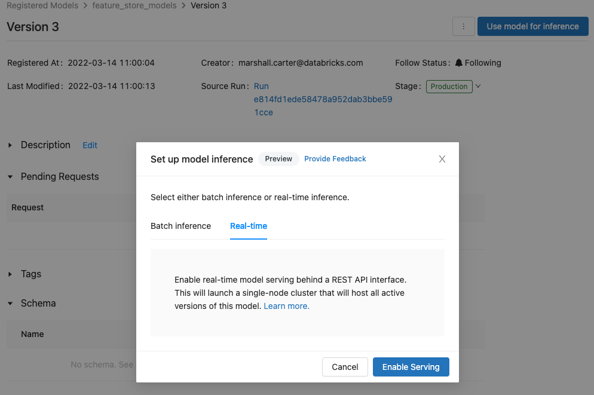
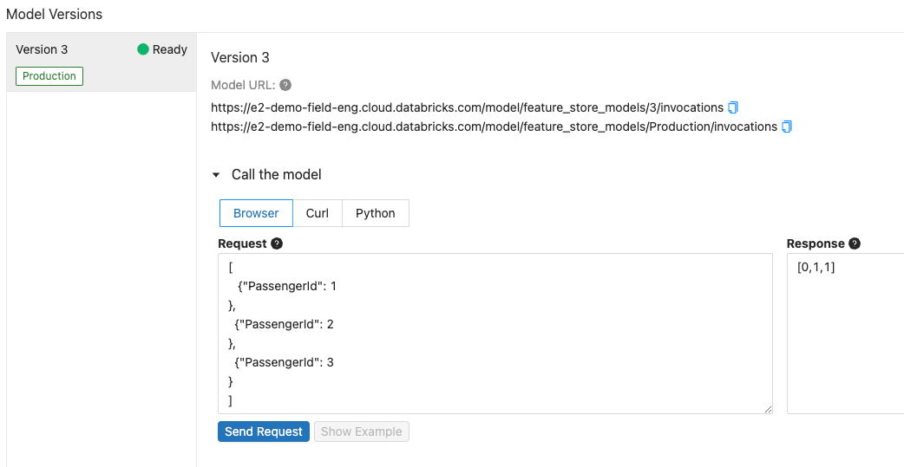

# Setting up an Online Feature Store and Model Serving endpoint

Some use cases require [Rest API model deployment](https://docs.databricks.com/applications/mlflow/model-serving.html) for inference. This is typically the case where an application outside of Databricks is recieving information and requires model predictions based on that information (imagine a user interface where a use can enter information and receive a prediction). Im some cases, this external application may not have access to all the features the model requires. We can leverage the Feature Store to publish tables to an RDBMS that can be access by our MLflow model deployed via Rest API. In our scenario, the external application would only need to pass the PassengerId to the Rest endpoint to retrieve a prediction for a passenger.



### To implement this demo in your own environment, follow the below steps.

## 1. Create an [AWS MySQL RDS](https://docs.aws.amazon.com/AmazonRDS/latest/UserGuide/Welcome.html) 

 You can use the example Terraform scripts to provision an RDS in the default VPC of your AWS account. You will need to [install and configure the AWS CLI](https://docs.aws.amazon.com/cli/latest/userguide/cli-chap-configure.html). As part of this process, you will need to enter your AWS access key id and secret access key. The Terraform scripts provision the below resources; your AWS User must have permission to create these resources. 
  - A Security Group that provides internet access to the database
  - A MySQL RDS  
  

Applying the terraform template will output a master username, password, and cluster endpoint address. These must be saved and will be used to authenticate to RDS. To view the non-redacted password, issue the command, 'terraform output -json' from the terminal after terraform provisions the resources.  

To provision the resources, navigate to the terraform folder in your terminal and issue the below commands, [assuming you have installed Terraform](https://learn.hashicorp.com/tutorials/terraform/install-cli).
```
terraform init
terraform plan
terraform apply
terraform output -json

# When you are ready to tear down the infrastructure
teffaform destroy
```

Note that the RDS provisioned by these scripts is designed for demonstration purposes. Further configuration would be required for a production deployment.


## 2. Connect to the Aurora cluster using a SQL editor
 - [DBeaver](https://dbeaver.io/) is an easy to use and free SQL editor that can easily connect to your RDS through a MySQL connection.
 - Create the MySQL connection using the master username, password, cluster endpoint address, and the database, 'feature_store', that was created by the Terraform.  




## 3. Create a user with write access and a user with read-only access to the feature store database.  
 - The crendtials for these users (user name and password) will be saved as Databricks Secrets referenceable by the Databricks Feature Store.
```
CREATE USER 'writer'@'%' IDENTIFIED BY '<writer-password>';
CREATE USER 'reader'@'%' IDENTIFIED BY '<reader-only-password';

GRANT ALL PRIVILEGES ON feature_store.* TO 'writer';
GRANT SELECT ON feature_store.* TO 'reader';

SELECT User FROM mysql.user;

SHOW GRANTS for writer;
SHOW GRANTS for reader;
```

## 4. Create two Databricks Secret Scopes; one for the write user's credentials and another for the read-only user's credentials.
 - Install and configure the [Databricks CLI](https://docs.databricks.com/dev-tools/cli/index.html) to authenticate to your Databricks workspace.
 - Use the CLI to create the secret scopes; each scope contains two secrets that share the same prefix (in the example below, 'feature_store-'). One of the secrets should contain the postfix, 'user' and the other 'password'. It is important [that you follow this syntax](https://docs.databricks.com/applications/machine-learning/feature-store/feature-tables.html#provide-online-store-credentials-using-databricks-secrets).
 ```

databricks secrets create-scope --scope feature_store_writer --profile e2-demo-east
databricks secrets create-scope --scope feature_store_reader --profile e2-demo-east

databricks secrets put --scope feature_store_writer --key feature_store-user --profile e2-demo-east
databricks secrets put --scope feature_store_writer --key feature_store-password --profile e2-demo-east

databricks secrets put --scope feature_store_reader --key feature_store-user --profile e2-demo-east
databricks secrets put --scope feature_store_reader --key feature_store-password --profile e2-demo-east
 ```

 - See the [Databricks Secrets documentation](https://docs.databricks.com/security/secrets/secrets.html) 
 - In general, to access Databricks Secrets within a workspace, [see the documentation](https://docs.databricks.com/dev-tools/databricks-utils.html#secrets-utility-dbutilssecrets)

When publishing Delta Feature Store tables to an RDS, the Feature Store will leverage the above items to establish a connection using the follow syntax.
 - Note that Feature Store tables are Delta tables; we are simply copying the Delta table to an RDS and esuring the tables are in synce by merging changes from the Delta Feature Store table to the RDS table.
```
host = 'feature-store.cluster-############.us-east-1.rds.amazonaws.com'
port = 3306
database_name = 'feature_store'
table_name = 'online_feature_table'
read_secret_prefix = 'feature_store_reader/feature_store'
write_secret_prefix = 'feature_store_writer/feature_store'

online_store = AmazonRdsMySqlSpec(
                    hostname=host, 
                    port=port,
                    read_secret_prefix=read_secret_prefix,
                    write_secret_prefix=write_secret_prefix, 
                    database_name=database_name, 
                    table_name=table_name
            )

fs.publish_table(name=f'default.{table_name}', # Delta table reference
                 online_store=online_store,
                 mode='merge')
```
See the [AmazonRdsMySqlSpec documentation](https://docs.databricks.com/dev-tools/api/python/latest/feature-store/online_store_spec/databricks.feature_store.online_store_spec.amazon_rds_mysql_online_store_spec.html#module-databricks.feature_store.online_store_spec.amazon_rds_mysql_online_store_spec)  

## 5. After running the Databricks Notebook to publish the Feature Store table, query the table using the SQL editor.
```
SELECT * FROM feature_store.online_feature_table;
``` 

## 6. Run the **publish_to_rds** notebook.  
This step assumes you previously ran the passenger_demographic_features and passenger_ticket_features notebooks to create the base feature tables. This notebook will create a third feature table and will published the table to the online feature store (RDS) created above.

## 7. Run the **fit_model** notebook.  
The notebook will perform the below tasks.
 - Create an MLflow experiment
 - Create a Feature Store training dataset
 - Train an XGBoost model on the training dataset and log the model with reference to the Feature Store training dataset to the MLflow experiment
 - Publish the model to the Model Registry
 - Transition the model to the Production stage.

 ## 8. Open the Model Registry and navigate to your model entry.  
 Select the "Production" model version, then select "Use model for inference" and choose "Real-time" and "Enable Serving"  
 
 


## 9. Submit sample records to the provisioned endpoint.  
Databricks will query the features for the input ids from the online feature store and return a prediction.  

 